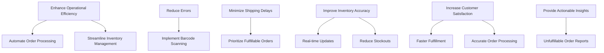
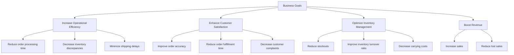
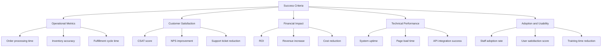
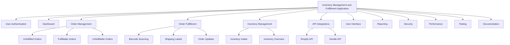
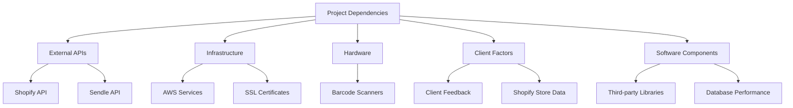
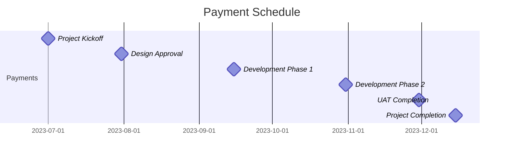
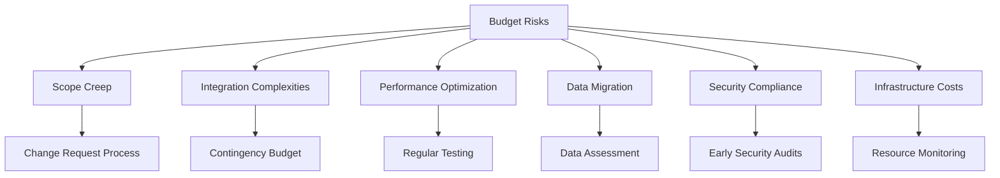
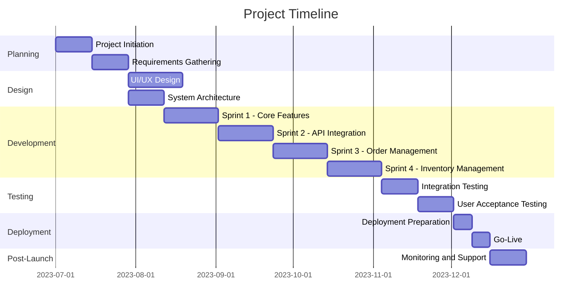
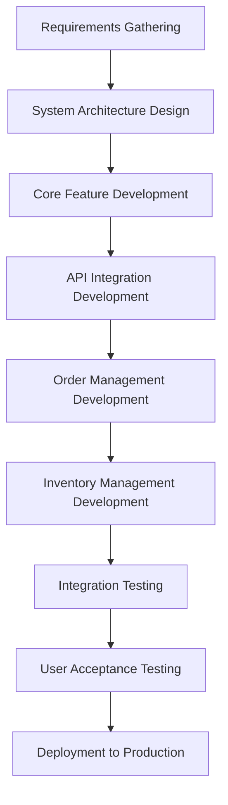
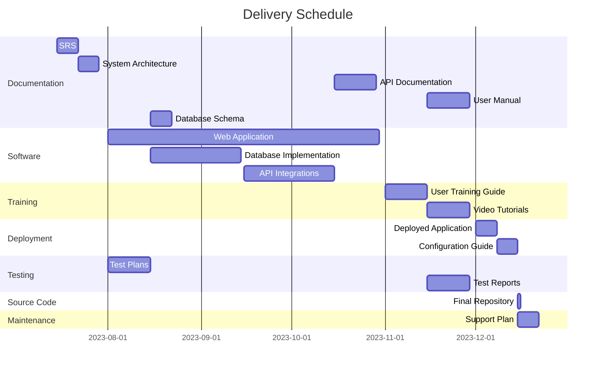

# EXECUTIVE SUMMARY

## PROJECT OVERVIEW

This project aims to develop a comprehensive web-based Inventory Management and Fulfillment Application for an e-commerce store operating on Shopify. The client faces challenges in efficiently managing inventory and streamlining the order fulfillment process, which are critical for maintaining customer satisfaction and operational efficiency. Our proposed solution addresses these pain points by providing a seamless integration between the client's Shopify store, inventory management system, and shipping processes.

The application will:
1. Automatically pull and categorize unfulfilled orders from Shopify
2. Determine order fulfillment feasibility based on real-time inventory levels
3. Facilitate a streamlined fulfillment process using barcode scanning technology
4. Generate shipping labels via Sendle API integration
5. Update Shopify orders and inventory levels in real-time

## OBJECTIVES

1. Enhance operational efficiency by automating order processing and inventory management
2. Reduce order fulfillment errors through barcode scanning validation
3. Minimize shipping delays by prioritizing fulfillable orders
4. Improve inventory accuracy and reduce stockouts
5. Increase customer satisfaction through faster and more accurate order fulfillment
6. Provide actionable insights on inventory needs through unfulfillable order reports

## VALUE PROPOSITION

Our agency offers a unique combination of expertise and tailored solutions that set us apart for this project:

1. **Seamless Integration**: Our deep understanding of Shopify and Sendle APIs ensures a smooth integration, minimizing disruptions to existing workflows.

2. **User-Centric Design**: We prioritize an intuitive, user-friendly interface that requires minimal training, increasing adoption rates and productivity.

3. **Scalability**: Our solution is built to grow with the client's business, capable of handling increasing order volumes and inventory complexity.

4. **Custom Reporting**: We provide actionable insights through custom reports, helping the client make informed decisions about inventory management and procurement.

5. **Ongoing Support**: Our commitment extends beyond development, offering continuous support and updates to ensure the solution evolves with the client's needs.

| Key Advantage | Description | Benefit to Client |
|---------------|-------------|-------------------|
| API Expertise | Proficiency in Shopify and Sendle integrations | Seamless connection between e-commerce, inventory, and shipping |
| User-Centric Approach | Intuitive interface design | Rapid adoption and increased efficiency |
| Scalable Architecture | Built to handle growth | Long-term solution that adapts to business expansion |
| Custom Analytics | Tailored reporting capabilities | Data-driven decision making for inventory and operations |
| Dedicated Support | Ongoing maintenance and updates | Continuous improvement and adaptation to changing needs |

By choosing our agency, the client gains not just a software solution, but a strategic partner committed to enhancing their e-commerce operations and driving business growth.

## PROJECT OBJECTIVES

### BUSINESS GOALS

1. Increase Operational Efficiency
   - Reduce order processing time by 50%
   - Decrease inventory discrepancies by 80%
   - Minimize shipping delays by 70%

2. Enhance Customer Satisfaction
   - Improve order accuracy to 99.9%
   - Reduce order fulfillment time by 40%
   - Decrease customer complaints related to shipping by 60%

3. Optimize Inventory Management
   - Reduce stockouts by 75%
   - Improve inventory turnover ratio by 30%
   - Decrease carrying costs by 25%

4. Boost Revenue
   - Increase sales by 15% through improved stock availability
   - Reduce lost sales due to stockouts by 80%

### TECHNICAL GOALS

1. Seamless Integration
   - Achieve full integration with Shopify API for real-time order and inventory synchronization
   - Implement Sendle API integration for automated shipping label generation

2. Performance Optimization
   - Ensure system response time under 2 seconds for all operations
   - Support concurrent processing of up to 1000 orders per hour

3. User Interface Enhancement
   - Develop an intuitive, responsive web interface compatible with desktop browsers
   - Implement barcode scanning functionality with 99.9% accuracy

4. Data Management and Security
   - Implement secure user authentication and role-based access control
   - Ensure data encryption for all sensitive information in transit and at rest

5. Scalability and Reliability
   - Design system architecture to handle a 300% increase in order volume without performance degradation
   - Achieve 99.9% uptime for the application

| Technical Goal | Description | Target Metric |
|----------------|-------------|---------------|
| API Integration | Shopify and Sendle API integration | 100% functionality |
| Performance | System response time | < 2 seconds |
| Concurrency | Order processing capacity | 1000 orders/hour |
| UI Responsiveness | Web interface compatibility | Desktop browsers |
| Barcode Scanning | Scanning accuracy | 99.9% |
| Security | Data encryption | 100% of sensitive data |
| Scalability | Order volume handling | 300% increase capacity |
| Reliability | System uptime | 99.9% |

### SUCCESS CRITERIA

1. Operational Metrics
   - Average order processing time reduced to 5 minutes or less
   - Inventory accuracy improved to 98% or higher
   - Order fulfillment cycle time decreased by 40% or more

2. Customer Satisfaction Indicators
   - Customer satisfaction score (CSAT) increased by 20 points
   - Net Promoter Score (NPS) improved by 15 points
   - Reduction in customer support tickets related to order issues by 50%

3. Financial Impact
   - Return on Investment (ROI) of 200% within the first year of implementation
   - Increase in overall revenue by 15% attributed to improved inventory management
   - Reduction in operational costs by 20% due to increased efficiency

4. Technical Performance
   - System uptime of 99.9% or higher
   - Average page load time under 2 seconds
   - Successful integration with Shopify and Sendle APIs with 99.9% transaction success rate

5. Adoption and Usability
   - 100% adoption rate by warehouse staff within 3 months of implementation
   - User satisfaction score of 4.5/5 or higher based on post-implementation surveys
   - 50% reduction in training time for new staff on inventory management processes

These success criteria will be used to evaluate the project's effectiveness and determine if it has met its intended objectives. Regular monitoring and reporting on these metrics will ensure the project stays on track and delivers the expected value to the business.

# SCOPE OF WORK

## IN-SCOPE

The Inventory Management and Fulfillment Application project includes the following tasks, features, and functionalities:

1. User Authentication and Authorization
   - Secure login system
   - Role-based access control (admin, warehouse staff)

2. Dashboard
   - Summary metrics display (unfulfilled orders, fulfillable orders, inventory levels)

3. Order Management
   - Unfulfilled Orders Tab
   - Orders That Can Be Fulfilled Tab
   - Orders That Cannot Be Fulfilled Tab with export functionality

4. Order Fulfillment Process
   - Fulfillment modal with barcode scanning
   - Shipping label generation via Sendle API
   - Shopify order status update
   - Inventory adjustment

5. Inventory Management
   - Inventory intake via barcode scanning and manual entry
   - Inventory overview with filtering and searching capabilities

6. Error Handling
   - User notifications
   - System logging
   - Retry mechanisms for API calls

7. API Integrations
   - Shopify API integration for order management
   - Sendle API integration for shipping label generation

8. User Interface
   - Responsive web application optimized for desktop browsers
   - Intuitive design with consistent layout across all pages

9. Reporting
   - Unfulfillable orders report generation

10. Security Implementation
    - Data encryption in transit and at rest
    - Secure handling of API credentials

11. Performance Optimization
    - Page load times within 2 seconds
    - Scalability considerations for order and inventory growth

12. Testing
    - Unit testing for critical components
    - Integration testing for system components

13. Documentation
    - User manuals
    - Technical documentation for maintenance

## OUT-OF-SCOPE

The following items are explicitly excluded from the project scope:

1. Mobile application development
2. Integration with multiple Shopify stores
3. Integration with shipping providers other than Sendle
4. Physical hardware provision (barcode scanners, printers)
5. Customization of Shopify store front-end
6. Historical data migration from existing systems
7. Advanced analytics or business intelligence features
8. Automated inventory reordering system
9. Customer-facing order tracking portal
10. Integration with accounting or ERP systems
11. Multi-language support
12. Offline mode functionality

## ASSUMPTIONS

The project plan is based on the following assumptions:

1. The client has an active Shopify store with admin API access.
2. The client has or will obtain a Sendle account for shipping integration.
3. The client will provide timely feedback during development iterations.
4. The client's staff will be available for user acceptance testing.
5. The client has compatible barcode scanning hardware.
6. The client's internet connectivity is stable and sufficient for web application use.
7. The client will provide necessary product data for initial system setup.
8. The client's Shopify plan supports the required API calls and webhooks.
9. The development team has access to necessary development environments and tools.
10. The client agrees to use AWS for hosting the application.

## DEPENDENCIES

The project timeline and deliverables may be impacted by the following dependencies:

| Dependency | Description | Potential Impact |
|------------|-------------|-------------------|
| Shopify API | Availability and stability of Shopify's API | Could affect order synchronization and updates |
| Sendle API | Functionality and uptime of Sendle's API | May impact shipping label generation |
| AWS Services | Reliability of AWS EC2 and related services | Could influence application hosting and performance |
| Barcode Scanner Compatibility | Integration with client's existing or new hardware | May affect inventory and fulfillment processes |
| Client's Shopify Data | Accuracy and completeness of existing Shopify store data | Could impact initial setup and data migration |
| Third-party Libraries | Availability and compatibility of required software libraries | May influence development timeline and feature implementation |
| Client Feedback | Timely responses and decision-making from the client | Could affect development iterations and final delivery |
| API Rate Limits | Shopify and Sendle API call limits | May require optimization of data sync processes |
| SSL Certificates | Acquisition and renewal of SSL certificates | Essential for secure HTTPS connections |
| Database Performance | PostgreSQL database scalability and performance | Could impact application responsiveness as data grows |

These dependencies will be closely monitored throughout the project lifecycle to mitigate risks and ensure timely delivery of the Inventory Management and Fulfillment Application.

## BUDGET AND COST ESTIMATES

### COST BREAKDOWN

The following table provides a detailed breakdown of the project costs for the Inventory Management and Fulfillment Application:

| Category | Item | Quantity | Unit Cost | Total Cost |
|----------|------|----------|-----------|------------|
| Labor | Senior Full-Stack Developer | 480 hours | $100/hour | $48,000 |
| Labor | UI/UX Designer | 120 hours | $80/hour | $9,600 |
| Labor | Project Manager | 160 hours | $90/hour | $14,400 |
| Labor | QA Specialist | 120 hours | $70/hour | $8,400 |
| Software | Development Tools and Licenses | 1 set | $2,000 | $2,000 |
| Infrastructure | AWS EC2 Instance (1 year) | 1 | $1,500 | $1,500 |
| Infrastructure | AWS RDS PostgreSQL (1 year) | 1 | $1,200 | $1,200 |
| Third-party Services | Shopify API (included in plan) | 1 | $0 | $0 |
| Third-party Services | Sendle API Integration | 1 | $500 | $500 |
| Miscellaneous | Testing Equipment | 1 set | $1,000 | $1,000 |
| Contingency | 10% of total budget | 1 | $8,660 | $8,660 |
| **Total** | | | | **$95,260** |

### PAYMENT SCHEDULE

The proposed payment schedule is tied to project milestones and deliverables:

| Milestone | Deliverable | Payment Percentage | Amount |
|-----------|-------------|---------------------|--------|
| Project Kickoff | Signed contract and initial planning documents | 20% | $19,052 |
| Design Approval | Approved UI/UX designs and technical architecture | 20% | $19,052 |
| Development Phase 1 | Core functionality implemented (Order Management, Inventory Management) | 25% | $23,815 |
| Development Phase 2 | API Integrations (Shopify, Sendle) and Fulfillment Process | 20% | $19,052 |
| User Acceptance Testing | Completed UAT and bug fixes | 10% | $9,526 |
| Project Completion | Final delivery, documentation, and training | 5% | $4,763 |

### BUDGET CONSIDERATIONS

Several factors could potentially impact the budget, and we have strategies in place to manage these risks:

1. **Scope Creep**
   - Risk: Additional features or changes requested during development.
   - Mitigation: Clearly defined scope in the contract, change request process with associated costs.

2. **Integration Complexities**
   - Risk: Unforeseen challenges with Shopify or Sendle API integrations.
   - Mitigation: Thorough research during planning phase, allocation of contingency budget for potential extra development time.

3. **Performance Optimization**
   - Risk: Additional time required to meet performance requirements.
   - Mitigation: Regular performance testing throughout development, early identification of bottlenecks.

4. **Data Migration**
   - Risk: Complexity in migrating existing data if required.
   - Mitigation: Detailed assessment of current data structures, inclusion of data migration specialist if needed (additional cost may apply).

5. **Security Compliance**
   - Risk: Additional security measures required to meet industry standards.
   - Mitigation: Early security audits, inclusion of security best practices in initial development.

6. **Infrastructure Costs**
   - Risk: Potential increase in AWS costs based on usage.
   - Mitigation: Regular monitoring of resource usage, optimization of infrastructure, clear communication with client about potential cost variations.

To manage these budget considerations effectively, we will:

1. Maintain open communication with the client about potential risks and their impact on the budget.
2. Conduct regular project status meetings to identify and address any issues early.
3. Utilize the contingency budget judiciously to address unforeseen challenges.
4. Provide detailed reports on budget utilization and projections throughout the project lifecycle.

By implementing these strategies, we aim to deliver the project within the estimated budget while maintaining flexibility to address unexpected challenges.

## TIMELINE AND MILESTONES

### PROJECT TIMELINE

The Inventory Management and Fulfillment Application project is estimated to take approximately 24 weeks (6 months) from initiation to completion. The high-level timeline is outlined below:

### KEY MILESTONES

The following table outlines the critical milestones that mark significant progress points in the project:

| Milestone | Description | Estimated Date |
|-----------|-------------|----------------|
| M1: Project Kickoff | Project initiation and team onboarding | 2023-07-01 |
| M2: Requirements Sign-off | Approval of detailed project requirements | 2023-07-28 |
| M3: Design Approval | Completion and approval of UI/UX and system architecture | 2023-08-25 |
| M4: Development Sprint 1 Complete | Core features implemented | 2023-09-15 |
| M5: Development Sprint 2 Complete | API integrations (Shopify, Sendle) implemented | 2023-10-06 |
| M6: Development Sprint 3 Complete | Order management features completed | 2023-10-27 |
| M7: Development Sprint 4 Complete | Inventory management features completed | 2023-11-17 |
| M8: Testing Complete | All testing phases finished, including UAT | 2023-12-08 |
| M9: Go-Live | Application deployed to production | 2023-12-22 |
| M10: Project Closure | Post-launch support completed, project handed over | 2024-01-05 |

### CRITICAL PATH

The critical path consists of tasks that directly impact the project timeline. Any delay in these tasks will result in a delay of the entire project:

1. Requirements Gathering and Sign-off
2. System Architecture Design
3. Core Feature Development (Sprint 1)
4. API Integration Development (Sprint 2)
5. Order Management Development (Sprint 3)
6. Inventory Management Development (Sprint 4)
7. Integration Testing
8. User Acceptance Testing
9. Deployment to Production

To ensure the project stays on schedule, the following strategies will be employed:

1. Regular progress tracking against milestones
2. Weekly status meetings to address any blockers or issues
3. Parallel execution of non-critical path tasks where possible
4. Buffer time included in each sprint for unforeseen challenges
5. Clear communication channels established for quick decision-making
6. Continuous risk assessment and mitigation planning

By closely monitoring these critical path items and implementing proactive management strategies, we aim to deliver the Inventory Management and Fulfillment Application on time and within scope.

# DELIVERABLES

## LIST OF DELIVERABLES

The following table provides a comprehensive list of all tangible outputs for the Inventory Management and Fulfillment Application project:

| Category | Deliverable | Description |
|----------|-------------|-------------|
| Software Components | Web Application | Fully functional web-based application for inventory management and order fulfillment |
| Software Components | Database | Implemented PostgreSQL database with all necessary tables and relationships |
| Software Components | API Integrations | Completed integrations with Shopify and Sendle APIs |
| Documentation | Software Requirements Specification (SRS) | Detailed document outlining all functional and non-functional requirements |
| Documentation | System Architecture Document | Comprehensive overview of the system's technical architecture |
| Documentation | User Manual | Step-by-step guide for end-users on how to use the application |
| Documentation | API Documentation | Detailed documentation of all API endpoints and their usage |
| Documentation | Database Schema | Complete database schema with table structures and relationships |
| Training Materials | User Training Guide | Training materials for warehouse staff and administrators |
| Training Materials | Video Tutorials | Set of instructional videos covering key features of the application |
| Deployment | Deployed Application | Application deployed and running on AWS EC2 instance |
| Deployment | Configuration Guide | Document detailing the deployment process and configuration settings |
| Testing | Test Plans | Comprehensive test plans for unit, integration, and user acceptance testing |
| Testing | Test Reports | Detailed reports of all testing phases, including bug reports and resolutions |
| Source Code | Version Controlled Repository | Git repository containing all source code, properly versioned and documented |
| Maintenance | Support Plan | Document outlining the post-launch support and maintenance procedures |

## DELIVERY SCHEDULE

The following Gantt chart illustrates the delivery schedule for each deliverable:

## ACCEPTANCE CRITERIA

The following table outlines the acceptance criteria for each major deliverable:

| Deliverable | Acceptance Criteria |
|-------------|---------------------|
| Web Application | - All features as specified in the SRS are implemented and functional - Application passes all unit and integration tests - User interface is responsive and meets design specifications - Application performs within specified performance parameters (e.g., page load times under 2 seconds) |
| Database | - All required tables and relationships are correctly implemented - Data integrity constraints are in place and functioning - Database can handle the specified load without performance degradation |
| API Integrations | - Successful connection and data exchange with Shopify and Sendle APIs - All required API endpoints are implemented and functional - Error handling and retry mechanisms are in place and working as expected |
| Documentation | - All documents are complete, accurate, and up-to-date - Documents are clear, well-structured, and free of grammatical errors - Technical jargon is explained or avoided where possible |
| Training Materials | - Materials cover all key features and processes of the application - Content is clear, concise, and suitable for the target audience - Video tutorials are of high quality with clear audio and visuals |
| Deployed Application | - Application is accessible via the specified URL - All features function correctly in the production environment - Application meets specified security requirements - Backup and disaster recovery processes are in place and tested |
| Test Reports | - All planned tests have been executed and documented - Any failed tests have corresponding bug reports and resolution status - Test coverage meets or exceeds the specified threshold |
| Source Code Repository | - All code is properly commented and follows agreed-upon coding standards - Repository includes a README file with setup and contribution guidelines - All dependencies are documented and version-controlled |
| Support Plan | - Plan clearly outlines support procedures, contact information, and SLAs - Escalation processes are defined - Plan includes provisions for future updates and maintenance |

Each deliverable will be reviewed against these criteria before being considered complete. The client will have a specified period (typically 5-10 business days) to review each deliverable and provide feedback or approval. Any issues or discrepancies will be addressed before the deliverable is finalized.