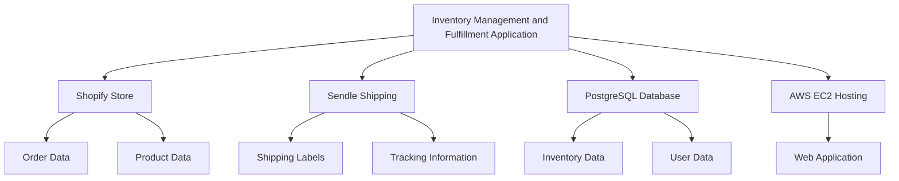
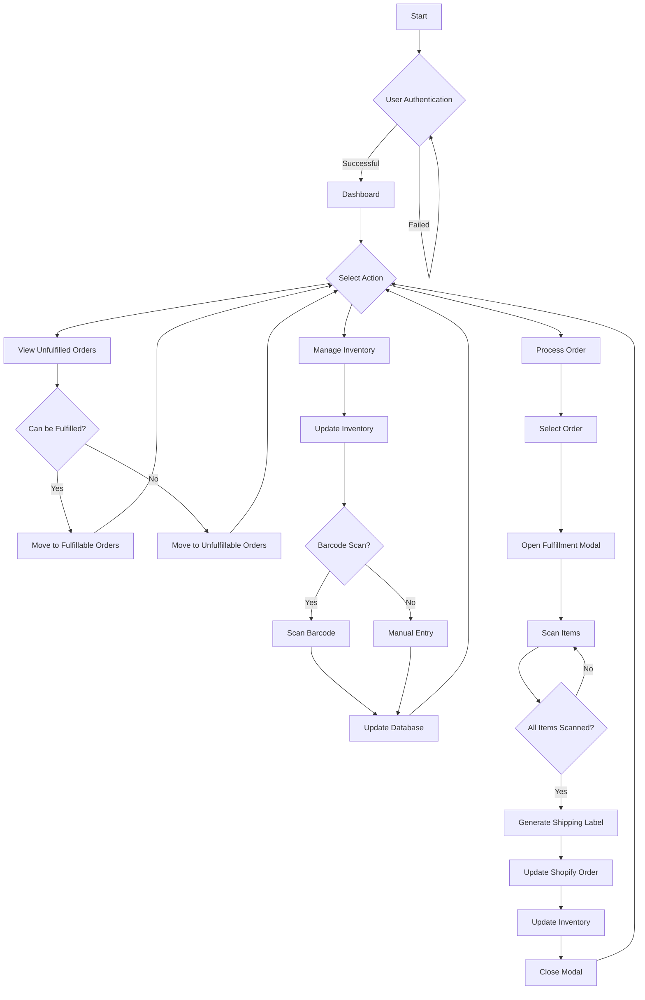
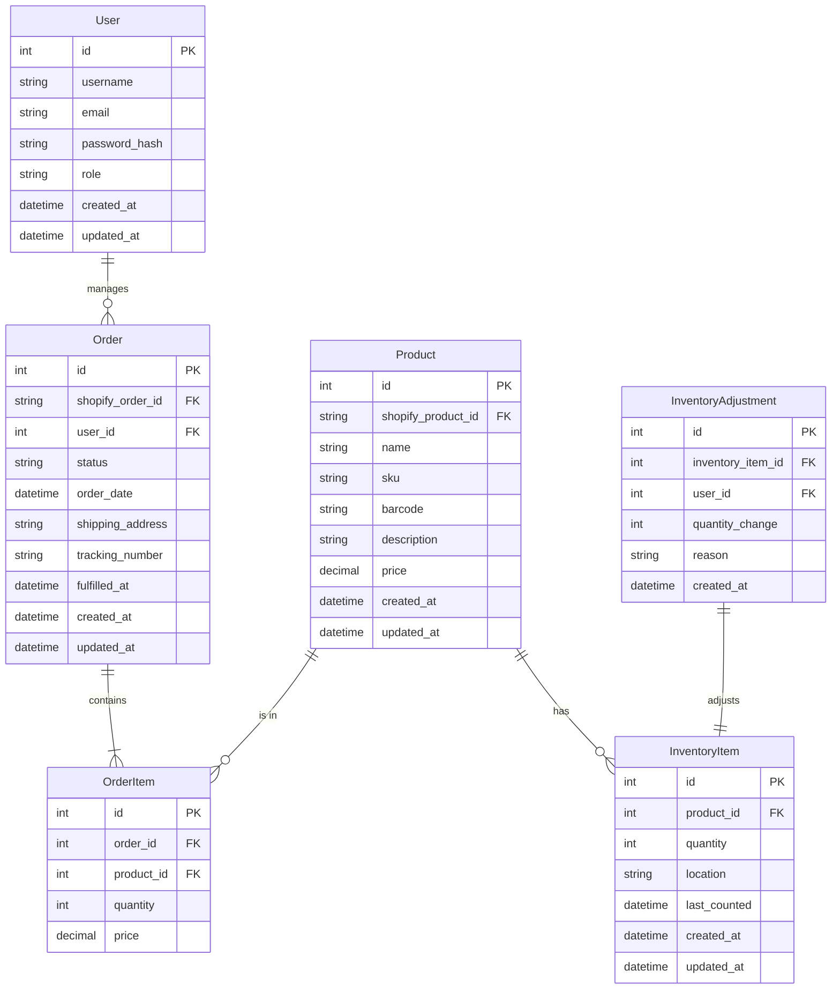
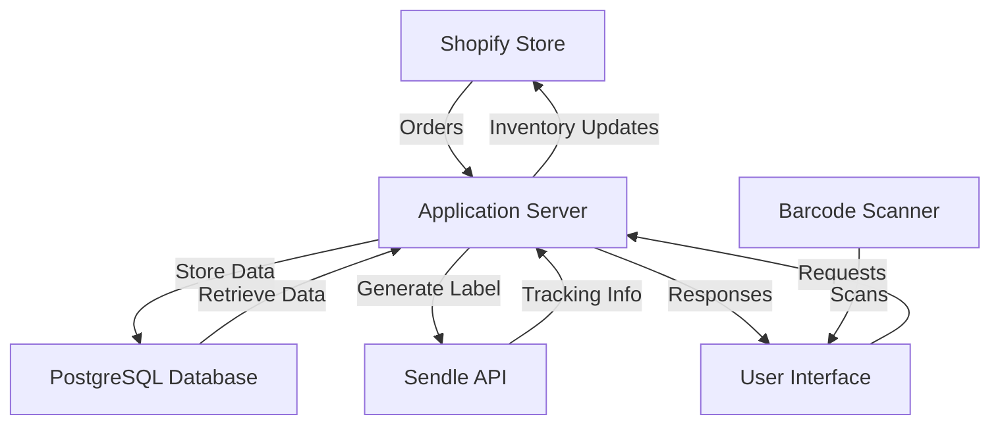

# 1. INTRODUCTION

## 1.1 PURPOSE

The purpose of this Software Requirements Specification (SRS) document is to provide a comprehensive and detailed description of the Inventory Management and Fulfillment Application for an e-commerce store operating on Shopify. This document serves as a blueprint for the development team, outlining the functional and non-functional requirements, system architecture, and technical specifications.

The intended audience for this SRS includes:

1. Development Team: To guide the implementation of the software system.
2. Project Managers: To plan and track the project's progress.
3. Quality Assurance Team: To develop test plans and ensure the software meets specified requirements.
4. Client Stakeholders: To review and approve the proposed solution.
5. Maintenance and Support Team: To understand the system for future updates and troubleshooting.

This SRS aims to establish a clear understanding between all parties involved in the development process, ensuring that the final product aligns with the client's needs and expectations.

## 1.2 SCOPE

The Inventory Management and Fulfillment Application is a web-based solution designed to streamline and automate the order fulfillment process for an e-commerce store operating on the Shopify platform. The system will integrate with Shopify and Sendle APIs to provide a seamless connection between the e-commerce storefront, inventory management, and shipping processes.

### Goals:

1. Automate the process of managing unfulfilled orders from Shopify.
2. Optimize inventory management through real-time tracking and updates.
3. Streamline the order fulfillment process with barcode scanning technology.
4. Integrate shipping label generation via Sendle API.
5. Provide actionable insights on inventory needs and unfulfillable orders.

### Benefits:

1. Increased operational efficiency by reducing manual order processing.
2. Improved inventory accuracy, leading to reduced stockouts and overstocking.
3. Enhanced customer satisfaction through faster and more accurate order fulfillment.
4. Reduced shipping errors and delays.
5. Better decision-making capabilities with real-time inventory and order data.

### Core Functionalities:

1. User Authentication and Authorization
   - Secure login system with role-based access control

2. Order Management
   - Automatic retrieval and categorization of unfulfilled Shopify orders
   - Determination of order fulfillment feasibility based on current inventory levels

3. Inventory Management
   - Real-time inventory tracking with barcode scanning capabilities
   - Manual inventory adjustments and bulk updates

4. Order Fulfillment Process
   - Guided fulfillment workflow with barcode scanning validation
   - Automated shipping label generation through Sendle API integration
   - Real-time updates to Shopify order status and inventory levels

5. Reporting and Analytics
   - Generation of unfulfillable order reports
   - Inventory level alerts and reorder suggestions

6. API Integrations
   - Seamless integration with Shopify API for order and product synchronization
   - Integration with Sendle API for shipping label generation

7. User Interface
   - Responsive web application optimized for desktop browsers
   - Intuitive dashboard with key metrics and actionable insights

The application will be developed using modern web technologies, including a JavaScript framework for the frontend (e.g., React, Angular, or Vue.js), a server-side language and framework for the backend (e.g., Node.js, Python with Django/Flask), and PostgreSQL for data storage. The system will be deployed on AWS EC2 instances to ensure scalability and reliability.

By focusing on these core functionalities and leveraging the specified technologies, the Inventory Management and Fulfillment Application aims to significantly improve the efficiency and accuracy of the client's e-commerce operations.

# 2. PRODUCT DESCRIPTION

## 2.1 PRODUCT PERSPECTIVE

The Inventory Management and Fulfillment Application is a web-based solution designed to integrate seamlessly with an existing e-commerce ecosystem built on the Shopify platform. This application serves as a critical bridge between the client's Shopify store, inventory management processes, and shipping operations through Sendle.

The system operates within the following context:

1. E-commerce Platform: Integrates directly with the client's Shopify store, pulling unfulfilled orders and updating order statuses and inventory levels in real-time.

2. Inventory Management: Acts as the central hub for tracking and managing product inventory, providing real-time visibility and control over stock levels.

3. Shipping Integration: Connects with Sendle's API to generate shipping labels and update tracking information, streamlining the fulfillment process.

4. User Interface: Provides a web-based interface accessible via desktop browsers, allowing warehouse staff and administrators to manage orders and inventory efficiently.

5. Data Storage: Utilizes a PostgreSQL database hosted on AWS RDS to store and manage application data, ensuring data integrity and scalability.

6. Hosting Environment: Deployed on AWS EC2 instances, leveraging cloud infrastructure for reliability and scalability.



## 2.2 PRODUCT FUNCTIONS

The Inventory Management and Fulfillment Application will perform the following key functions:

1. Order Management
   - Automatically retrieve unfulfilled orders from Shopify
   - Categorize orders based on fulfillment feasibility
   - Display order details and status

2. Inventory Tracking
   - Real-time inventory level monitoring
   - Barcode scanning for inventory updates
   - Manual inventory adjustments and bulk updates

3. Order Fulfillment
   - Guided fulfillment process with barcode scanning validation
   - Automated shipping label generation via Sendle API
   - Real-time order status updates in Shopify

4. Reporting and Analytics
   - Generate reports on unfulfillable orders
   - Provide inventory level alerts and reorder suggestions
   - Display key metrics on a dashboard

5. User Management
   - Secure authentication and authorization
   - Role-based access control for different user types

6. API Integrations
   - Seamless data synchronization with Shopify API
   - Integration with Sendle API for shipping operations

7. Error Handling and Logging
   - Comprehensive error tracking and notification system
   - Detailed activity logging for auditing and troubleshooting

## 2.3 USER CHARACTERISTICS

The Inventory Management and Fulfillment Application is designed to cater to the following user types:

1. Warehouse Staff
   - Expertise Level: Low to Medium
   - Primary Tasks: Order fulfillment, inventory updates, barcode scanning
   - Characteristics: May have limited technical skills, require intuitive interface
   - Persona: John, 35, Warehouse Associate with 5 years of experience in e-commerce fulfillment

2. Inventory Managers
   - Expertise Level: Medium to High
   - Primary Tasks: Inventory management, report analysis, reorder planning
   - Characteristics: Proficient with inventory systems, data-driven decision makers
   - Persona: Sarah, 42, Inventory Manager with 10 years of experience in supply chain management

3. E-commerce Administrators
   - Expertise Level: High
   - Primary Tasks: System configuration, user management, performance monitoring
   - Characteristics: Technically savvy, responsible for overall system health
   - Persona: Alex, 38, E-commerce Operations Manager with a background in IT

4. Business Owners
   - Expertise Level: Medium
   - Primary Tasks: Dashboard review, high-level reporting, strategic decision making
   - Characteristics: Focus on business metrics and overall performance
   - Persona: Emma, 45, Small Business Owner managing an growing e-commerce brand

## 2.4 CONSTRAINTS

The development and operation of the Inventory Management and Fulfillment Application are subject to the following constraints:

1. Technical Constraints
   - Must be compatible with desktop web browsers (Chrome, Firefox, Safari, Edge)
   - Limited to integration with Shopify and Sendle APIs
   - Developed using JavaScript framework for frontend (React, Angular, or Vue.js)
   - Backend developed with Node.js or Python (Django/Flask)
   - Database limited to PostgreSQL

2. Regulatory Constraints
   - Must comply with data protection regulations (e.g., GDPR, CCPA)
   - Adherence to PCI DSS standards for handling payment information

3. Business Constraints
   - Budget limited to $95,260 as outlined in the cost breakdown
   - Project timeline constrained to 24 weeks (6 months)

4. Operational Constraints
   - System must handle up to 1000 orders per hour during peak times
   - Application response time must be under 2 seconds for all operations

5. Integration Constraints
   - Limited by Shopify and Sendle API rate limits and functionality
   - Dependent on the client's Shopify plan features and limitations

6. Security Constraints
   - All data must be encrypted in transit and at rest
   - Implementation of role-based access control

7. Infrastructure Constraints
   - Deployment limited to AWS EC2 and RDS services
   - Scalability within the confines of chosen AWS instance types

## 2.5 ASSUMPTIONS AND DEPENDENCIES

The project plan and system design are based on the following assumptions and dependencies:

### Assumptions

1. The client has an active Shopify store with admin API access.
2. The client will provide timely feedback during development iterations.
3. The client's staff will be available for user acceptance testing.
4. The client has compatible barcode scanning hardware.
5. The client's internet connectivity is stable and sufficient for web application use.
6. The development team has access to necessary development environments and tools.
7. The client agrees to use AWS for hosting the application.
8. The current order volume does not exceed 1000 orders per hour.

### Dependencies

1. Shopify API
   - Availability and stability of Shopify's API
   - Compatibility with the client's Shopify plan features

2. Sendle API
   - Functionality and uptime of Sendle's API
   - Sendle's shipping service availability in the client's operational areas

3. AWS Services
   - Reliability and availability of AWS EC2 and RDS services
   - Sufficient capacity within the chosen AWS instance types

4. Third-party Libraries
   - Availability and compatibility of required software libraries
   - Ongoing support and updates for chosen frameworks and libraries

5. Client Resources
   - Timely provision of necessary product data for initial system setup
   - Availability of client stakeholders for reviews and approvals

6. Regulatory Compliance
   - Continued alignment with current data protection and e-commerce regulations
   - No significant changes in compliance requirements during development

7. Hardware Compatibility
   - Compatibility of the client's existing or new barcode scanning hardware with the application

8. Internet Connectivity
   - Reliable internet connection at the client's warehouse facilities

By acknowledging these assumptions and dependencies, the project team can better manage risks and ensure the successful delivery of the Inventory Management and Fulfillment Application.

Here's the PROCESS FLOWCHART section for the Software Requirements Specifications (SRS) document using Mermaid JS, maintaining consistency with the previously mentioned technology and framework choices:

# PROCESS FLOWCHART

The following flowchart illustrates the main processes of the Inventory Management and Fulfillment Application:



This flowchart outlines the primary processes within the application:

1. User Authentication: The process begins with user login.
2. Dashboard: Upon successful authentication, users are directed to the main dashboard.
3. Action Selection: Users can choose between viewing unfulfilled orders, managing inventory, or processing an order.
4. Unfulfilled Orders: Orders are categorized as fulfillable or unfulfillable based on inventory availability.
5. Inventory Management: Users can update inventory through barcode scanning or manual entry.
6. Order Processing: This includes selecting an order, scanning items, generating a shipping label via Sendle API, updating the Shopify order status, and adjusting inventory levels.

The flowchart demonstrates the integration with Shopify for order management and Sendle for shipping label generation, as well as the use of barcode scanning technology for inventory updates and order fulfillment. This aligns with the previously specified technology choices and framework decisions.

Here's a breakdown of the Inventory Management and Fulfillment Application into features, maintaining consistency with the previously mentioned technology and framework choices:

1. User Authentication and Authorization

ID: F001
DESCRIPTION: Secure login system with role-based access control for different user types (e.g., admin, warehouse staff).
PRIORITY: High

TABLE OF FUNCTIONAL REQUIREMENTS:
| Requirement ID | Description |
|----------------|-------------|
| F001-1 | Implement secure login using industry-standard encryption |
| F001-2 | Create and manage user roles with different access levels |
| F001-3 | Implement password reset functionality |
| F001-4 | Integrate with existing authentication systems if applicable |

2. Dashboard

ID: F002
DESCRIPTION: A central dashboard displaying key metrics and providing quick access to main features.
PRIORITY: Medium

TABLE OF FUNCTIONAL REQUIREMENTS:
| Requirement ID | Description |
|----------------|-------------|
| F002-1 | Display summary of unfulfilled orders |
| F002-2 | Show current inventory levels for key products |
| F002-3 | Provide quick links to main application features |
| F002-4 | Implement customizable widgets for different user roles |

3. Order Management

ID: F003
DESCRIPTION: Comprehensive system for managing and processing orders from Shopify.
PRIORITY: High

TABLE OF FUNCTIONAL REQUIREMENTS:
| Requirement ID | Description |
|----------------|-------------|
| F003-1 | Automatically retrieve unfulfilled orders from Shopify |
| F003-2 | Categorize orders into fulfillable and unfulfillable based on inventory |
| F003-3 | Provide detailed view of individual order information |
| F003-4 | Implement order search and filtering functionality |

4. Inventory Management

ID: F004
DESCRIPTION: Real-time inventory tracking system with barcode scanning capabilities.
PRIORITY: High

TABLE OF FUNCTIONAL REQUIREMENTS:
| Requirement ID | Description |
|----------------|-------------|
| F004-1 | Implement barcode scanning for inventory updates |
| F004-2 | Provide manual inventory adjustment functionality |
| F004-3 | Set up low stock alerts and reorder suggestions |
| F004-4 | Enable bulk inventory updates via CSV import |

5. Order Fulfillment Process

ID: F005
DESCRIPTION: Streamlined process for fulfilling orders using barcode scanning and automated shipping label generation.
PRIORITY: High

TABLE OF FUNCTIONAL REQUIREMENTS:
| Requirement ID | Description |
|----------------|-------------|
| F005-1 | Implement guided fulfillment workflow with barcode scanning |
| F005-2 | Integrate with Sendle API for automated shipping label generation |
| F005-3 | Update order status in Shopify upon fulfillment |
| F005-4 | Provide error handling for mismatched or excess scanned items |

6. Reporting and Analytics

ID: F006
DESCRIPTION: Generate reports on unfulfillable orders and provide insights on inventory needs.
PRIORITY: Medium

TABLE OF FUNCTIONAL REQUIREMENTS:
| Requirement ID | Description |
|----------------|-------------|
| F006-1 | Generate exportable reports on unfulfillable orders |
| F006-2 | Provide inventory turnover analysis |
| F006-3 | Implement customizable reporting dashboard |
| F006-4 | Set up automated report scheduling and delivery |

7. Shopify Integration

ID: F007
DESCRIPTION: Seamless integration with Shopify for order and product synchronization.
PRIORITY: High

TABLE OF FUNCTIONAL REQUIREMENTS:
| Requirement ID | Description |
|----------------|-------------|
| F007-1 | Implement Shopify API integration for order retrieval |
| F007-2 | Sync product information between Shopify and the application |
| F007-3 | Handle Shopify webhooks for real-time updates |
| F007-4 | Implement error handling and retry mechanisms for API calls |

8. Sendle Integration

ID: F008
DESCRIPTION: Integration with Sendle API for shipping label generation and tracking.
PRIORITY: High

TABLE OF FUNCTIONAL REQUIREMENTS:
| Requirement ID | Description |
|----------------|-------------|
| F008-1 | Implement Sendle API integration for label generation |
| F008-2 | Retrieve and store tracking information |
| F008-3 | Handle shipping rate calculations |
| F008-4 | Implement error handling for failed API calls |

9. User Interface

ID: F009
DESCRIPTION: Responsive web application optimized for desktop browsers.
PRIORITY: Medium

TABLE OF FUNCTIONAL REQUIREMENTS:
| Requirement ID | Description |
|----------------|-------------|
| F009-1 | Develop responsive UI using React.js |
| F009-2 | Implement intuitive navigation and layout |
| F009-3 | Ensure compatibility with major desktop browsers |
| F009-4 | Implement accessibility features for diverse user needs |

10. Error Handling and Logging

ID: F010
DESCRIPTION: Comprehensive error tracking and notification system with detailed activity logging.
PRIORITY: Medium

TABLE OF FUNCTIONAL REQUIREMENTS:
| Requirement ID | Description |
|----------------|-------------|
| F010-1 | Implement centralized error logging system |
| F010-2 | Set up real-time error notifications for critical issues |
| F010-3 | Develop detailed activity logs for auditing purposes |
| F010-4 | Implement log rotation and archiving for efficient storage |

This feature breakdown maintains consistency with the previously mentioned technology choices, including the use of React.js for the frontend, a server-side language like Node.js or Python for the backend, PostgreSQL for the database, and deployment on AWS EC2 instances. The integration with Shopify and Sendle APIs is also prominently featured in the breakdown.

# 5. NON-FUNCTIONAL REQUIREMENTS

## 5.1 PERFORMANCE

1. Response Time:
   - The application shall load pages within 2 seconds under normal load conditions.
   - API responses shall be returned within 500 milliseconds for 95% of requests.
   - Order processing, including inventory updates and shipping label generation, shall complete within 5 seconds.

2. Throughput:
   - The system shall support processing of up to 1000 orders per hour during peak times.
   - The application shall handle up to 100 concurrent users without performance degradation.

3. Resource Usage:
   - The application shall utilize no more than 70% of allocated CPU resources under normal load.
   - Database queries shall be optimized to execute within 100 milliseconds for 90% of requests.
   - The application shall consume no more than 4GB of RAM under normal operating conditions.

## 5.2 SAFETY

1. Data Backup:
   - The system shall perform automated daily backups of all critical data.
   - Backups shall be stored in a separate AWS region for disaster recovery purposes.

2. Error Handling:
   - The application shall gracefully handle and log all errors without exposing sensitive information to users.
   - In case of critical failures, the system shall revert to a safe state and notify administrators.

3. Inventory Safeguards:
   - The system shall implement safeguards to prevent negative inventory counts.
   - A daily reconciliation process shall be in place to identify and report any inventory discrepancies.

## 5.3 SECURITY

1. Authentication:
   - The system shall implement multi-factor authentication for all user accounts.
   - Passwords shall be hashed using bcrypt with a minimum work factor of 10.

2. Authorization:
   - Role-based access control (RBAC) shall be implemented to restrict access to sensitive functions and data.
   - All API endpoints shall require proper authentication and authorization.

3. Data Encryption:
   - All data in transit shall be encrypted using TLS 1.2 or higher.
   - Sensitive data at rest, including in the PostgreSQL database, shall be encrypted using AES-256.

4. Privacy:
   - The system shall comply with GDPR and CCPA requirements for data protection and privacy.
   - Personal data shall be anonymized or pseudonymized where possible.

5. API Security:
   - API keys and secrets for Shopify and Sendle integrations shall be stored securely using AWS Secrets Manager.
   - API rate limiting shall be implemented to prevent abuse.

## 5.4 QUALITY

1. Availability:
   - The system shall maintain 99.9% uptime, excluding scheduled maintenance windows.
   - Scheduled maintenance shall be performed during off-peak hours and limited to 4 hours per month.

2. Maintainability:
   - The codebase shall adhere to agreed-upon coding standards and best practices.
   - The system shall use dependency injection and modular architecture to facilitate easy updates and maintenance.
   - Comprehensive documentation shall be maintained for all system components and APIs.

3. Usability:
   - The user interface shall be intuitive and require no more than 2 hours of training for warehouse staff to become proficient.
   - The system shall provide clear error messages and guidance for resolution.
   - The application shall be compatible with the latest versions of Chrome, Firefox, Safari, and Edge browsers.

4. Scalability:
   - The application architecture shall support horizontal scaling to handle increased load.
   - The database shall be designed to efficiently handle a 300% increase in data volume without significant performance degradation.

5. Reliability:
   - The system shall have a Mean Time Between Failures (MTBF) of at least 720 hours.
   - Automated monitoring and alerting shall be in place to detect and notify of any system anomalies.

## 5.5 COMPLIANCE

1. Legal:
   - The application shall comply with all relevant e-commerce laws and regulations in the jurisdictions where it operates.
   - Terms of service and privacy policy shall be clearly displayed and require user acceptance.

2. Regulatory:
   - The system shall comply with PCI DSS standards for handling payment information.
   - Data retention and deletion policies shall be implemented in accordance with GDPR and CCPA requirements.

3. Standards:
   - The application shall adhere to WCAG 2.1 Level AA standards for web accessibility.
   - RESTful API design shall follow OpenAPI Specification 3.0 standards.
   - Code quality shall be maintained with a minimum score of 80% as measured by SonarQube or equivalent tool.

4. Audit Trail:
   - The system shall maintain a comprehensive audit trail of all critical actions, including order processing, inventory changes, and user activities.
   - Audit logs shall be retained for a minimum of 1 year and be easily exportable for compliance reviews.

These non-functional requirements ensure that the Inventory Management and Fulfillment Application meets high standards of performance, safety, security, quality, and compliance. They align with the previously mentioned technology choices, including the use of AWS services, PostgreSQL database, and integration with Shopify and Sendle APIs.

# 6. DATA REQUIREMENTS

## 6.1 DATA MODELS

The Inventory Management and Fulfillment Application will utilize the following data models to represent the core entities and their relationships:



This entity-relationship diagram represents the core data structures of the application, including Users, Orders, Products, Inventory Items, and their relationships. The model supports the key functionalities of order management, inventory tracking, and user access control.

## 6.2 DATA STORAGE

The application will use PostgreSQL as the primary database management system, hosted on AWS RDS for scalability and reliability. The following data storage requirements will be implemented:

1. Data Retention:
   - Order data will be retained for a minimum of 7 years to comply with financial regulations.
   - Inventory adjustment logs will be kept for 3 years for auditing purposes.
   - User activity logs will be retained for 1 year.

2. Redundancy:
   - AWS RDS Multi-AZ deployment will be used to ensure high availability and data redundancy across multiple availability zones.

3. Backup:
   - Automated daily backups of the entire database will be performed and retained for 30 days.
   - Point-in-time recovery will be enabled, allowing data restoration to any point within the last 35 days.

4. Recovery:
   - A disaster recovery plan will be documented, including procedures for database restoration from backups.
   - Regular disaster recovery drills will be conducted to ensure the effectiveness of the recovery process.

5. Scalability:
   - Vertical scaling of the RDS instance will be implemented initially to handle growing data volumes.
   - Horizontal scaling through read replicas will be considered for future expansion if required.

## 6.3 DATA PROCESSING

The application will implement the following data processing requirements:

1. Data Security:
   - All sensitive data, including user credentials and API keys, will be encrypted at rest using AWS RDS encryption.
   - Data in transit will be encrypted using TLS 1.2 or higher.
   - Access to the database will be restricted to the application servers and authorized personnel only, using AWS security groups and network ACLs.
   - Regular security audits and penetration testing will be conducted to ensure data protection.

2. Data Flow:
   The following diagram illustrates the high-level data flow within the application:



3. Data Validation:
   - Input validation will be implemented on both client-side and server-side to ensure data integrity.
   - Database constraints and triggers will be used to enforce data consistency.

4. Data Synchronization:
   - Real-time synchronization with Shopify will be implemented for orders and product data.
   - Inventory levels will be updated in real-time as orders are fulfilled or inventory adjustments are made.

5. Data Caching:
   - Redis will be used for caching frequently accessed data, such as product information and current inventory levels, to improve application performance.

6. Data Archiving:
   - An archiving strategy will be implemented to move historical order and inventory data to separate tables or a data warehouse after a specified period (e.g., 2 years) to maintain optimal performance of the main database.

7. Data Logging:
   - Comprehensive logging of all data modifications, including user actions, API calls, and system processes, will be implemented for auditing and troubleshooting purposes.

8. Data Export:
   - Functionality to export data in common formats (CSV, JSON) will be provided for reporting and data analysis purposes.

By implementing these data requirements, the Inventory Management and Fulfillment Application will ensure secure, efficient, and reliable data handling throughout its operations.

# 3. EXTERNAL INTERFACES

## 3.1 USER INTERFACES

The Inventory Management and Fulfillment Application will provide a web-based user interface optimized for desktop browsers. The interface will be designed with a focus on usability, efficiency, and intuitive navigation to support warehouse staff and administrators in their daily tasks.

Key user interface requirements include:

1. Responsive design optimized for desktop browsers (Chrome, Firefox, Safari, Edge)
2. Intuitive navigation menu for easy access to all major functions
3. Dashboard with key metrics and quick access to main features
4. Clear and consistent layout across all pages
5. User-friendly forms for data entry and updates
6. Barcode scanning interface for inventory management and order fulfillment
7. Search and filter functionality for orders and inventory items
8. Modal windows for focused tasks like order fulfillment
9. Clearly visible error messages and confirmations
10. Accessibility features compliant with WCAG 2.1 Level AA standards

Placeholder for mockups:

```
[Dashboard Mockup]
- Display summary of unfulfilled orders
- Show current inventory levels for key products
- Provide quick links to main application features

[Order Management Mockup]
- List of unfulfilled orders with key details
- Tabs for "Can Be Fulfilled" and "Cannot Be Fulfilled" orders
- Search and filter options

[Inventory Management Mockup]
- List of inventory items with current stock levels
- Barcode scanning interface for updates
- Search and filter options

[Order Fulfillment Modal Mockup]
- Display order details
- Barcode scanning interface for item verification
- Progress indicator for scanned items
```

## 3.2 HARDWARE INTERFACES

The Inventory Management and Fulfillment Application will interface with the following hardware components:

1. Barcode Scanners
   - Connection Type: USB or Bluetooth
   - Compatibility: Must support common 1D and 2D barcode formats (e.g., UPC, QR)
   - Driver: Standard HID (Human Interface Device) driver
   - Data Format: ASCII string output

2. Label Printers
   - Connection Type: USB or Network (Ethernet/Wi-Fi)
   - Compatibility: Must support common shipping label sizes (4x6 inches)
   - Driver: Standard printer drivers (e.g., PCL, ZPL)
   - Print Resolution: Minimum 203 dpi

The application will interact with these hardware components through standard operating system interfaces and device drivers. No custom hardware interfaces will be developed as part of this project.

## 3.3 SOFTWARE INTERFACES

The Inventory Management and Fulfillment Application will interface with the following external software systems:

1. Shopify API
   - Purpose: Retrieve unfulfilled orders, update order status, and sync inventory levels
   - Version: Latest stable version of Shopify Admin API
   - Data Format: JSON
   - Communication Protocol: HTTPS
   - Authentication: OAuth 2.0
   - Rate Limits: As per Shopify API documentation, with implemented throttling

2. Sendle API
   - Purpose: Generate shipping labels and retrieve tracking information
   - Version: Latest stable version of Sendle API
   - Data Format: JSON
   - Communication Protocol: HTTPS
   - Authentication: API Key
   - Rate Limits: As per Sendle API documentation, with implemented throttling

3. PostgreSQL Database
   - Purpose: Store application data, including inventory, orders, and user information
   - Version: PostgreSQL 13 or higher
   - Connection: Managed through an ORM (e.g., Sequelize for Node.js or SQLAlchemy for Python)
   - Data Format: SQL

4. AWS Services
   - EC2: For application hosting
   - RDS: For managed PostgreSQL database hosting
   - S3: For storing application logs and backups
   - Interaction: Through AWS SDK for the chosen backend language (Node.js or Python)

## 3.4 COMMUNICATION INTERFACES

The Inventory Management and Fulfillment Application will utilize the following communication interfaces:

1. HTTP/HTTPS
   - Purpose: All client-server communication and API interactions
   - Protocol: HTTP/1.1 and HTTP/2
   - Port: 80 (HTTP) and 443 (HTTPS)
   - Security: TLS 1.2 or higher for all HTTPS connections

2. WebSockets
   - Purpose: Real-time updates for inventory changes and order status
   - Protocol: WSS (WebSocket Secure)
   - Port: 443
   - Data Format: JSON

3. SMTP
   - Purpose: Sending email notifications for order status updates and system alerts
   - Protocol: SMTP with TLS
   - Port: 587 (TLS) or 465 (SSL)
   - Authentication: Username and password or OAuth 2.0

4. Database Connection
   - Purpose: Communication between the application server and PostgreSQL database
   - Protocol: PostgreSQL wire protocol
   - Port: 5432 (default PostgreSQL port)
   - Security: SSL/TLS encryption for data in transit

5. AWS Service Communication
   - Purpose: Interaction with AWS services (EC2, RDS, S3)
   - Protocol: HTTPS
   - Authentication: AWS IAM roles and policies
   - Data Format: As specified by AWS SDK

All communication interfaces will implement appropriate error handling, retry mechanisms, and logging to ensure reliable and secure data exchange. The application will also respect rate limits and implement backoff strategies where necessary to prevent overwhelming external services.

# APPENDICES

## GLOSSARY

- **Barcode Scanning**: The process of using optical technology to read and interpret barcode data.
- **Fulfillment**: The process of receiving, packaging, and shipping orders to customers.
- **Inventory Turnover**: A ratio showing how many times a company has sold and replaced inventory during a given period.
- **SKU (Stock Keeping Unit)**: A unique identifier for each distinct product and service that can be purchased.
- **Webhook**: A method of augmenting or altering the behavior of a web page or web application with custom callbacks.

## ACRONYMS

- **API**: Application Programming Interface
- **AWS**: Amazon Web Services
- **CSAT**: Customer Satisfaction Score
- **EC2**: Elastic Compute Cloud
- **GDPR**: General Data Protection Regulation
- **NPS**: Net Promoter Score
- **PCI DSS**: Payment Card Industry Data Security Standard
- **RDS**: Relational Database Service
- **REST**: Representational State Transfer
- **ROI**: Return on Investment
- **SLA**: Service Level Agreement
- **SSL**: Secure Sockets Layer
- **TLS**: Transport Layer Security
- **UAT**: User Acceptance Testing
- **UI**: User Interface
- **UX**: User Experience
- **WCAG**: Web Content Accessibility Guidelines

## ADDITIONAL REFERENCES

1. Shopify API Documentation: https://shopify.dev/api
2. Sendle API Documentation: https://developers.sendle.com/
3. AWS EC2 User Guide: https://docs.aws.amazon.com/AWSEC2/latest/UserGuide/
4. PostgreSQL Documentation: https://www.postgresql.org/docs/
5. React.js Documentation: https://reactjs.org/docs/getting-started.html
6. Node.js Documentation: https://nodejs.org/en/docs/
7. OWASP Web Security Testing Guide: https://owasp.org/www-project-web-security-testing-guide/
8. WCAG 2.1 Guidelines: https://www.w3.org/TR/WCAG21/

These additional references provide comprehensive information on the technologies and standards used in the development of the Inventory Management and Fulfillment Application. They serve as valuable resources for the development team, maintainers, and any stakeholders seeking in-depth understanding of the system's components and best practices.