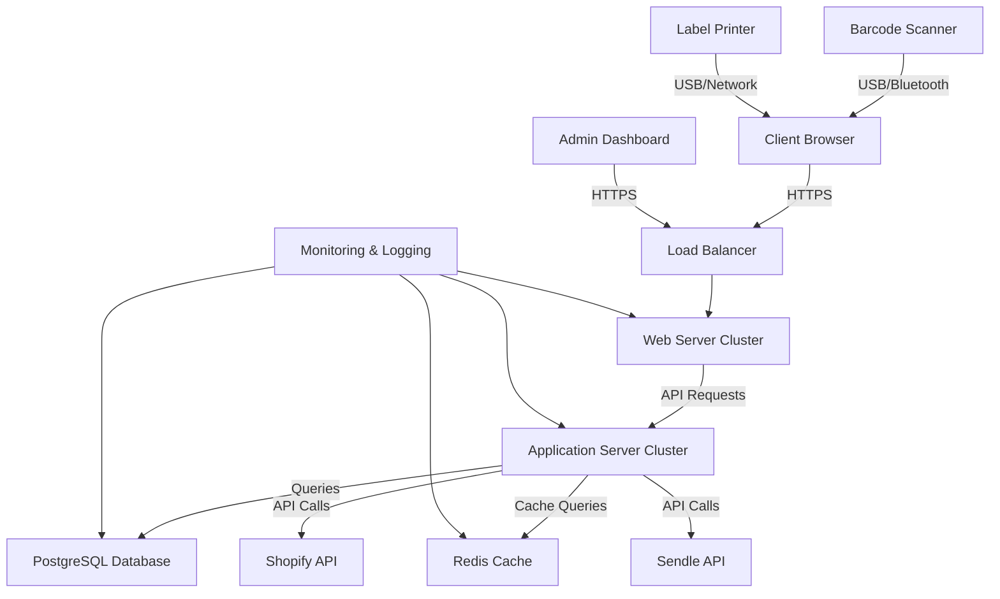
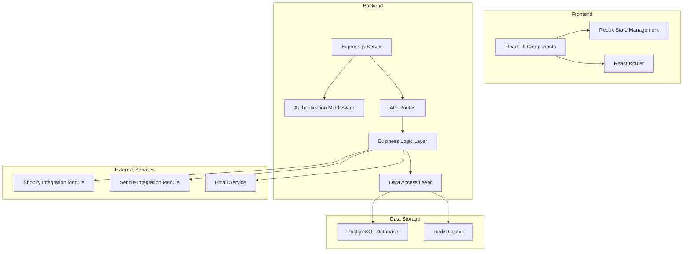
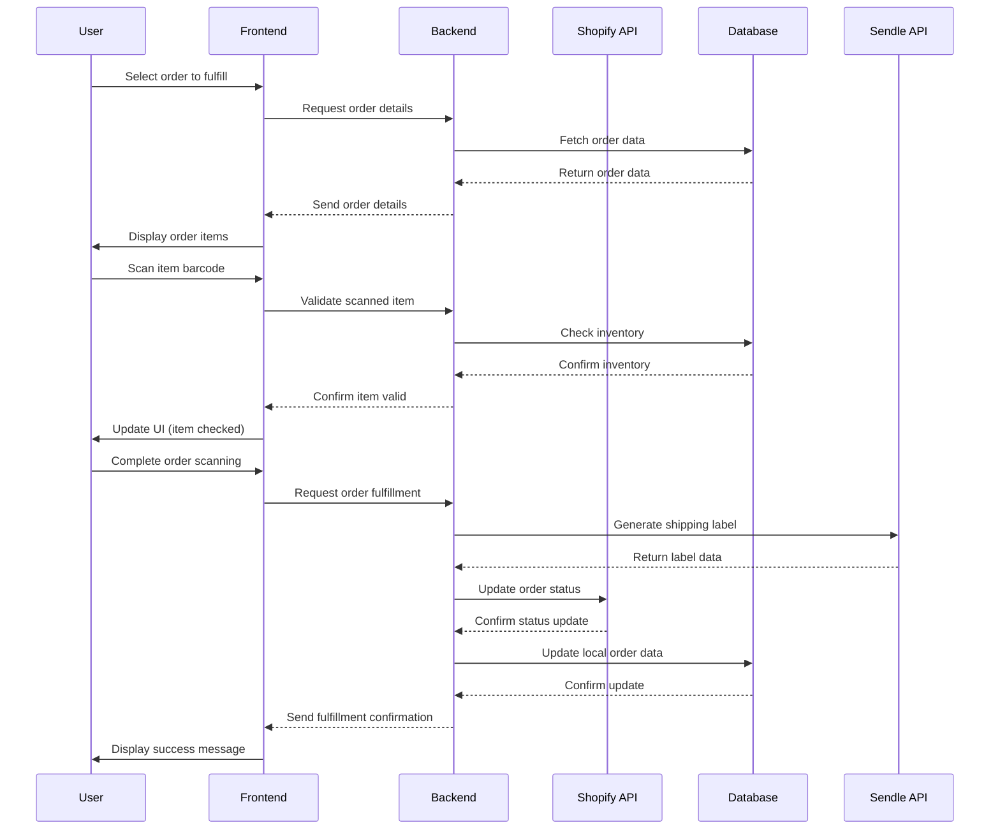
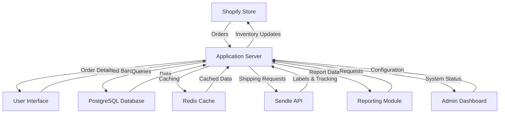
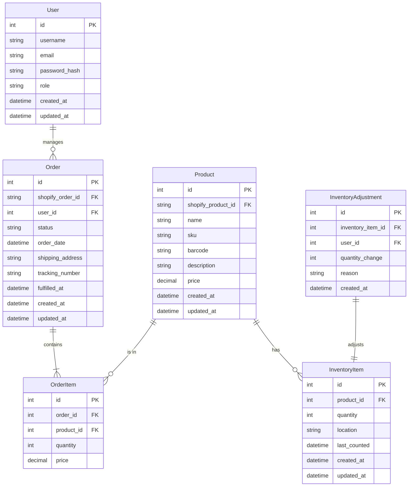
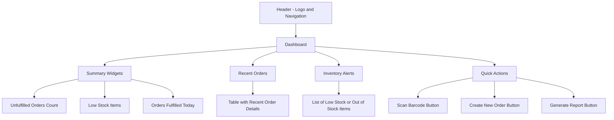
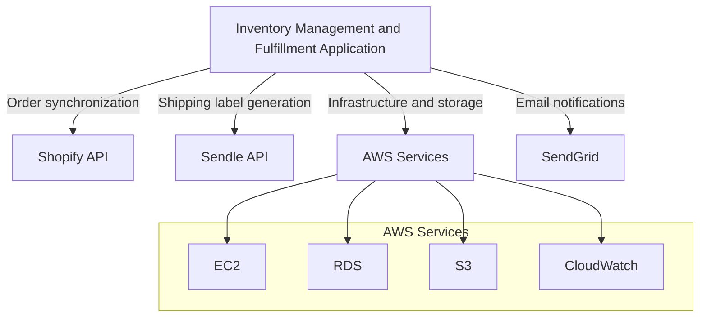
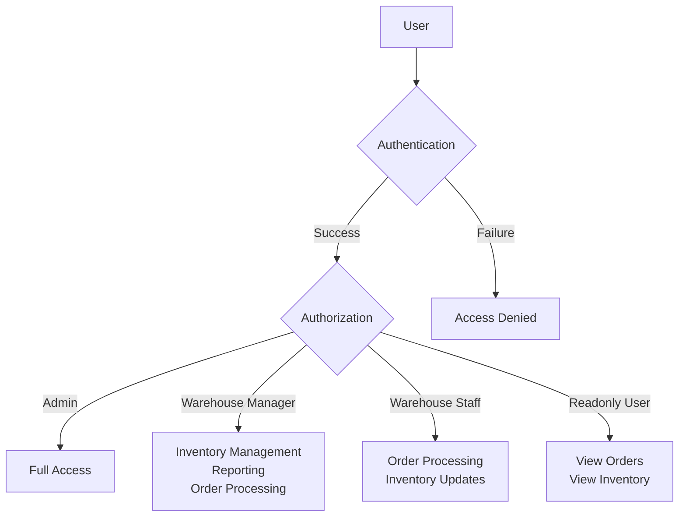

# 1. INTRODUCTION

## 1.1 SYSTEM OVERVIEW

The Inventory Management and Fulfillment Application is a comprehensive web-based solution designed to streamline and automate the order fulfillment process for an e-commerce store operating on the Shopify platform. This system integrates seamlessly with Shopify and Sendle APIs to provide a robust connection between the e-commerce storefront, inventory management, and shipping processes.

### High-Level Architecture

```mermaid
graph TD
    A[Shopify Store] <--> B[Application Server]
    B <--> C[PostgreSQL Database]
    B <--> D[Sendle API]
    E[Web Browser] <--> B
    F[Barcode Scanner] --> E
    G[Label Printer] <-- B
    H[AWS Services] <-- B
    
    subgraph AWS Cloud
    B
    C
    H
    end
```

### Key Components

1. **Frontend**: A responsive web application built with React.js, optimized for desktop browsers.
2. **Backend**: Server-side application developed using Node.js or Python (with a framework like Express.js or Flask), handling business logic and API integrations.
3. **Database**: PostgreSQL database hosted on AWS RDS for data persistence.
4. **External Integrations**: 
   - Shopify API for order and product synchronization
   - Sendle API for shipping label generation and tracking
5. **Infrastructure**: Hosted on AWS EC2 instances with additional AWS services for scalability and reliability.

### Core Functionalities

| Feature | Description |
|---------|-------------|
| User Authentication | Secure login system with role-based access control |
| Order Management | Automatic retrieval and categorization of unfulfilled Shopify orders |
| Inventory Tracking | Real-time inventory management with barcode scanning capabilities |
| Order Fulfillment | Guided fulfillment process with barcode validation and automated shipping label generation |
| Reporting | Generation of unfulfillable order reports and inventory insights |

### System Interactions

1. The application continuously syncs with the Shopify store to retrieve unfulfilled orders and update inventory levels.
2. Users interact with the system through a web interface, performing tasks such as order processing and inventory management.
3. During order fulfillment, the system interfaces with barcode scanners for item verification and label printers for shipping label output.
4. The Sendle API is utilized for generating shipping labels and retrieving tracking information.
5. All data is persisted in the PostgreSQL database, with real-time updates reflected in the user interface.

This system is designed to significantly improve operational efficiency, reduce errors in order fulfillment, and provide real-time visibility into inventory levels and order statuses. By leveraging modern web technologies and cloud infrastructure, the application ensures scalability, reliability, and seamless integration with existing e-commerce operations.

# 5. SYSTEM ARCHITECTURE

## 5.1 PROGRAMMING LANGUAGES

The Inventory Management and Fulfillment Application will utilize the following programming languages:

| Language | Purpose | Justification |
|----------|---------|---------------|
| JavaScript (Node.js) | Backend server | - Excellent performance for I/O-intensive operations<br>- Large ecosystem of libraries and frameworks<br>- Seamless JSON handling for API integrations |
| JavaScript (React) | Frontend UI | - Component-based architecture for reusable UI elements<br>- Virtual DOM for efficient updates<br>- Large community support and extensive libraries |
| SQL | Database queries | - Powerful querying capabilities for complex data operations<br>- Standard language for relational databases (PostgreSQL) |
| Python | Data processing and scripts | - Excellent for data manipulation and analysis<br>- Useful for creating maintenance scripts and data migration tools |

## 5.2 HIGH-LEVEL ARCHITECTURE DIAGRAM

The following diagram provides an overview of the system's components and their interactions:



## 5.3 COMPONENT DIAGRAMS

The following diagram details the specific components within the system and their relationships:



## 5.4 SEQUENCE DIAGRAMS

The following sequence diagram illustrates the order fulfillment process:



## 5.5 DATA-FLOW DIAGRAM

The following diagram explains how information moves through the system:



This data flow diagram illustrates the movement of information between various components of the Inventory Management and Fulfillment Application. Key points include:

1. Bidirectional data flow between the Shopify store and the application server for order and inventory synchronization.
2. User interactions through the interface, including barcode scanning and order management.
3. Database queries and caching mechanisms for efficient data retrieval.
4. Integration with the Sendle API for shipping-related operations.
5. Data flow to and from the reporting module for analytics and insights.
6. Configuration and monitoring through the admin dashboard.

This architecture ensures efficient data processing, real-time updates, and seamless integration with external services while maintaining data consistency and system performance.

# 5. SYSTEM DESIGN

## 5.1 PROGRAMMING LANGUAGES

The Inventory Management and Fulfillment Application will utilize the following programming languages:

| Language | Purpose | Justification |
|----------|---------|---------------|
| JavaScript (Node.js) | Backend server | - Excellent performance for I/O-intensive operations<br>- Large ecosystem of libraries and frameworks<br>- Seamless JSON handling for API integrations |
| JavaScript (React) | Frontend UI | - Component-based architecture for reusable UI elements<br>- Virtual DOM for efficient updates<br>- Large community support and extensive libraries |
| SQL | Database queries | - Powerful querying capabilities for complex data operations<br>- Standard language for relational databases (PostgreSQL) |
| Python | Data processing and scripts | - Excellent for data manipulation and analysis<br>- Useful for creating maintenance scripts and data migration tools |

## 5.2 DATABASE DESIGN

The application will use PostgreSQL as the primary database management system. The database design will follow a relational model to ensure data integrity and efficient querying. Below is a high-level schema design:



Key considerations for the database design:

1. Indexing on frequently queried columns (e.g., order_id, product_id, barcode)
2. Use of foreign key constraints to maintain referential integrity
3. Implementation of database triggers for automatic timestamp updates
4. Partitioning of large tables (e.g., Order, InventoryAdjustment) for improved query performance

## 5.3 API DESIGN

The application will implement a RESTful API design for both internal communication between frontend and backend, as well as for integration with external services (Shopify and Sendle). The API will follow these principles:

1. Use of standard HTTP methods (GET, POST, PUT, DELETE)
2. Stateless communication
3. Resource-based URLs
4. JSON for data exchange
5. Use of HTTP status codes for error handling

Key API endpoints:

| Endpoint | Method | Description |
|----------|--------|-------------|
| `/api/orders` | GET | Retrieve list of orders |
| `/api/orders/{id}` | GET | Retrieve specific order details |
| `/api/orders/{id}/fulfill` | POST | Process order fulfillment |
| `/api/inventory` | GET | Retrieve inventory levels |
| `/api/inventory/{id}` | PUT | Update inventory item |
| `/api/products` | GET | Retrieve product list |
| `/api/shipping-label` | POST | Generate shipping label |

API security measures:

1. JWT (JSON Web Tokens) for authentication
2. Rate limiting to prevent abuse
3. Input validation and sanitization
4. HTTPS encryption for all API communications

## 5.4 USER INTERFACE DESIGN

The user interface will be developed using React.js, focusing on a clean, intuitive, and responsive design optimized for desktop browsers. The UI will follow these design principles:

1. Consistent layout and navigation across all pages
2. Use of a modular component-based architecture
3. Responsive design for various screen sizes
4. Accessibility compliance (WCAG 2.1 Level AA)

Key UI components:

1. Dashboard
   - Summary widgets for unfulfilled orders, inventory levels, and recent activities
   - Quick action buttons for common tasks

2. Order Management
   - Tabular view of orders with sorting and filtering options
   - Detailed order view with fulfillment actions

3. Inventory Management
   - Grid view of inventory items with search and filter capabilities
   - Barcode scanning interface for quick updates

4. Fulfillment Process
   - Step-by-step guided interface for order fulfillment
   - Barcode scanning integration for item verification

5. Reporting
   - Customizable charts and graphs for inventory and order analytics
   - Export functionality for generated reports

User interface mockup for the dashboard:



This user interface design ensures a user-friendly experience that aligns with the application's goals of efficient inventory management and order fulfillment. The use of React.js will allow for the creation of reusable components and efficient state management, resulting in a responsive and performant user interface.

# 6. TECHNOLOGY STACK

## 6.1 PROGRAMMING LANGUAGES

The following programming languages will be used in the development of the Inventory Management and Fulfillment Application:

| Language | Purpose | Justification |
|----------|---------|---------------|
| JavaScript (Node.js) | Backend server | - Excellent performance for I/O-intensive operations<br>- Large ecosystem of libraries and frameworks<br>- Seamless JSON handling for API integrations |
| JavaScript (React) | Frontend UI | - Component-based architecture for reusable UI elements<br>- Virtual DOM for efficient updates<br>- Large community support and extensive libraries |
| SQL | Database queries | - Powerful querying capabilities for complex data operations<br>- Standard language for relational databases (PostgreSQL) |
| Python | Data processing and scripts | - Excellent for data manipulation and analysis<br>- Useful for creating maintenance scripts and data migration tools |

## 6.2 FRAMEWORKS AND LIBRARIES

The following frameworks and libraries will be utilized in the development process:

### Backend

| Framework/Library | Purpose |
|-------------------|---------|
| Express.js | Web application framework for Node.js |
| Sequelize | ORM for database interactions |
| Passport.js | Authentication middleware |
| Jest | Testing framework |
| Winston | Logging library |

### Frontend

| Framework/Library | Purpose |
|-------------------|---------|
| React | UI library for building component-based interfaces |
| Redux | State management |
| React Router | Routing library for React applications |
| Axios | HTTP client for API requests |
| Material-UI | React component library for consistent UI design |
| Jest | Testing framework |

## 6.3 DATABASES

The application will use the following database systems:

| Database | Purpose | Justification |
|----------|---------|---------------|
| PostgreSQL | Primary data storage | - Robust relational database with excellent performance<br>- Strong support for complex queries and transactions<br>- ACID compliance for data integrity |
| Redis | Caching and session storage | - In-memory data structure store for high-performance caching<br>- Pub/sub capabilities for real-time features |

## 6.4 THIRD-PARTY SERVICES

The following external services and APIs will be integrated into the system:



1. Shopify API
   - Purpose: Retrieve unfulfilled orders, update order status, and sync inventory levels
   - Version: Latest stable version of Shopify Admin API

2. Sendle API
   - Purpose: Generate shipping labels and retrieve tracking information
   - Version: Latest stable version of Sendle API

3. AWS Services
   - EC2: Application hosting
   - RDS: Managed PostgreSQL database hosting
   - S3: Storage for application logs and backups
   - CloudWatch: Monitoring and logging

4. SendGrid
   - Purpose: Sending transactional emails and notifications
   - Features: Email templates, delivery tracking, and analytics

This technology stack has been chosen to provide a robust, scalable, and maintainable solution for the Inventory Management and Fulfillment Application. It leverages well-established technologies and services that align with the project's requirements and constraints.

# 7. SECURITY CONSIDERATIONS

## 7.1 AUTHENTICATION AND AUTHORIZATION

The Inventory Management and Fulfillment Application will implement a robust authentication and authorization system to ensure secure access and protect sensitive operations.

### 7.1.1 Authentication

1. Multi-factor Authentication (MFA):
   - Implement MFA for all user accounts using Time-based One-Time Passwords (TOTP).
   - Integrate with AWS Cognito for secure user management and authentication.

2. Password Policy:
   - Enforce strong password requirements:
     - Minimum 12 characters
     - Combination of uppercase, lowercase, numbers, and special characters
     - Password expiration every 90 days
     - Prevent reuse of the last 5 passwords
   - Implement account lockout after 5 failed login attempts.

3. Session Management:
   - Use JWT (JSON Web Tokens) for maintaining user sessions.
   - Set token expiration to 1 hour for active sessions.
   - Implement secure token storage on the client-side using HttpOnly cookies.

### 7.1.2 Authorization

Implement Role-Based Access Control (RBAC) with the following roles and permissions:

| Role | Permissions |
|------|-------------|
| Admin | Full access to all system features and settings |
| Warehouse Manager | Manage inventory, view reports, process orders |
| Warehouse Staff | Process orders, update inventory |
| Readonly User | View orders and inventory without modification rights |



## 7.2 DATA SECURITY

To protect sensitive information and maintain data integrity, the following measures will be implemented:

1. Encryption:
   - Use AES-256 encryption for data at rest in the PostgreSQL database.
   - Implement TLS 1.3 for all data in transit.
   - Utilize AWS Key Management Service (KMS) for key management.

2. Data Masking:
   - Implement data masking for sensitive information in logs and error messages.
   - Mask credit card numbers, leaving only the last four digits visible.

3. Secure API Communication:
   - Use OAuth 2.0 for Shopify API authentication.
   - Implement API key rotation for Sendle API access.
   - Store API keys and secrets in AWS Secrets Manager.

4. Database Security:
   - Implement row-level security in PostgreSQL for fine-grained access control.
   - Use prepared statements to prevent SQL injection attacks.
   - Enable PostgreSQL audit logging for tracking database activities.

5. Backup and Recovery:
   - Implement daily encrypted backups of the database to AWS S3.
   - Ensure backups are stored in a different AWS region for disaster recovery.
   - Conduct regular restore tests to verify backup integrity.

## 7.3 SECURITY PROTOCOLS

The following security protocols will be implemented to maintain overall system security:

1. Network Security:
   - Implement AWS Web Application Firewall (WAF) to protect against common web exploits.
   - Use AWS VPC with private subnets for database and application servers.
   - Implement network segmentation to isolate critical components.

2. Monitoring and Logging:
   - Utilize AWS CloudWatch for centralized logging and monitoring.
   - Implement real-time alerts for suspicious activities or system anomalies.
   - Conduct regular log reviews and security audits.

3. Vulnerability Management:
   - Perform weekly automated vulnerability scans using AWS Inspector.
   - Conduct quarterly penetration testing by a third-party security firm.
   - Implement a patch management process for timely security updates.

4. Incident Response:
   - Develop and maintain an incident response plan.
   - Conduct regular incident response drills.
   - Implement automated incident detection and response using AWS GuardDuty.

5. Secure Development Practices:
   - Follow OWASP Top 10 guidelines for secure web application development.
   - Implement code review processes with security-focused checklists.
   - Use static code analysis tools integrated into the CI/CD pipeline.

6. Third-party Security:
   - Conduct security assessments of third-party integrations (Shopify, Sendle).
   - Implement vendor risk management processes.
   - Regularly review and update third-party access permissions.

7. Compliance:
   - Ensure compliance with PCI DSS for handling payment information.
   - Implement GDPR and CCPA compliant data handling practices.
   - Conduct annual compliance audits.

```mermaid
graph TD
    A[Security Protocols] --> B[Network Security]
    A --> C[Monitoring and Logging]
    A --> D[Vulnerability Management]
    A --> E[Incident Response]
    A --> F[Secure Development]
    A --> G[Third-party Security]
    A --> H[Compliance]
    
    B --> B1[AWS WAF]
    B --> B2[VPC]
    B --> B3[Network Segmentation]
    
    C --> C1[CloudWatch]
    C --> C2[Real-time Alerts]
    C --> C3[Log Reviews]
    
    D --> D1[Vulnerability Scans]
    D --> D2[Penetration Testing]
    D --> D3[Patch Management]
    
    E --> E1[Incident Response Plan]
    E --> E2[Response Drills]
    E --> E3[GuardDuty]
    
    F --> F1[OWASP Top 10]
    F --> F2[Code Reviews]
    F --> F3[Static Analysis]
    
    G --> G1[Vendor Assessments]
    G --> G2[Risk Management]
    G --> G3[Access Reviews]
    
    H --> H1[PCI DSS]
    H --> H2[GDPR/CCPA]
    H --> H3[Compliance Audits]
```



These security considerations ensure that the Inventory Management and Fulfillment Application maintains a strong security posture, protecting sensitive data and operations while complying with relevant regulations and industry best practices.